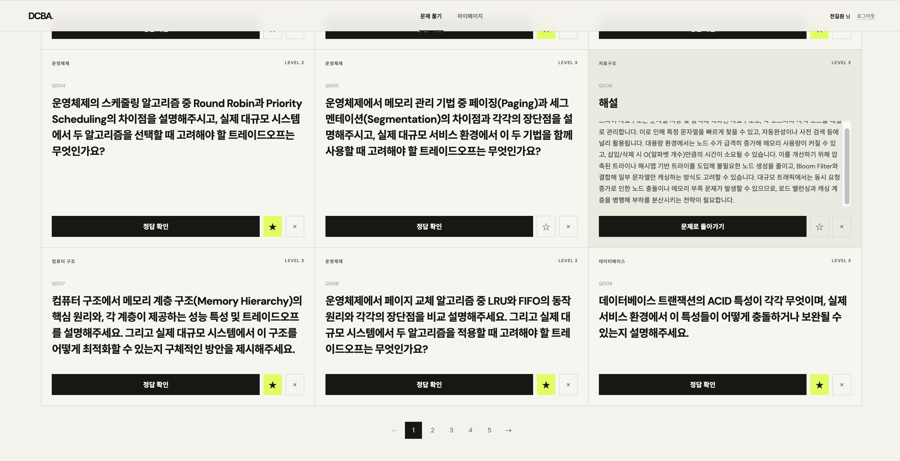
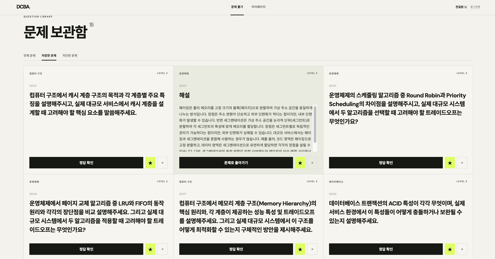

# DCBA
> CS 학습을 위한 LLM CS 문제 생성 서비스
## 목차
1. [기능](#기능)
2. [요약](#요약)
3. [실행 조건](#1-실행-조건)
4. [실행 방법](#2-전체-서비스-실행)
5. [접속 주소](#3-접속-주소)
6. [실행 확인](#4-정상-실행-확인)
7. [주요 명령어](#5-주요-명령)
8. [선택 설정](#6-선택-설정)
9. [서비스 이미지 확인](#서비스-이미지) 


## 기능
1. 문제 자동 생성 (1분)
2. 원하는 문제 생성 요청
3. 문제 중복 생성 방지
4. 문제 저장 및 차단 기능
    - 저장 : 원하는 문제만 따로 모아보기
    - 차단 : 문제 전체 확인 시 안 보이도록 설정
5. 웹을 통해 문제 확인 가능
    - 정답 확인 버튼을 통해 정답 확인 가능

## 요약
| 항목 | 내용 |
|---|---|
| Web | React |
| API | Spring Boot |
| LLM | FastAPI + `kakaocorp/kanana-2-3b-instruct` |
| Data | MariaDB + Redis |
| 실행 | Docker Compose |

## 1. 실행 조건

| 필수 항목 | 기준 |
|---|---|
| Docker | Docker Desktop 또는 Docker Engine + Compose |
| 메모리 | Kanana 실행 시 Docker 메모리 12GB 이상 권장 |
| 디스크 | 최초 모델 다운로드용 여유 공간 7GB 이상 |

## 2. 전체 서비스 실행

```bash
docker compose --profile llm up -d --build
```

| 최초 실행 | 내용 |
|---|---|
| 모델 다운로드 | Kanana 가중치 약 6.5GB 다운로드 |
| 모델 캐시 | `huggingface_cache` Docker 볼륨에 보관 |
| 문제 생성 | CPU 환경에서는 첫 생성에 시간이 오래 걸릴 수 있음 |

## 3. 접속 주소

| 서비스 | 주소 |
|---|---|
| Web | http://localhost |
| Spring API | http://localhost:8080 |
| LLM API 문서 | http://localhost:8000/docs |
| LLM 상태 확인 | http://localhost:8000/health |

## 4. 정상 실행 확인

```bash
docker compose --profile llm ps
docker logs -f llm-server
```

| 로그 | 상태 |
|---|---|
| `[Kanana] Model loaded: kakaocorp/kanana-2-3b-instruct` | 모델 준비 완료 |
| `[Consumer] Processing: ...` | 문제 생성 중 |
| `[Consumer] Saved : ... (ID : ...)` | DB 저장 완료 |

## 5. 주요 명령

| 작업 | 명령 |
|---|---|
| 기본 서비스만 실행 | `docker compose up -d --build` |
| LLM 포함 실행 | `docker compose --profile llm up -d --build` |
| 모니터링 포함 실행 | `docker compose --profile llm --profile monitoring up -d --build` |
| 전체 상태 확인 | `docker compose --profile llm ps` |
| LLM 로그 확인 | `docker logs -f llm-server` |
| 생성 대기 작업 수 확인 | `docker exec redis-cache redis-cli LLEN exercise:generation_queue` |
| 전체 중지 | `docker compose down` |

## 6. 선택 설정

| 조건 | 설정 |
|---|---|
| 기본값으로 실행 | `.env` 파일 불필요 |
| 포트·모델·중복검사 변경 | `.env.example`을 `.env`로 복사 후 수정 |

```bash
cp .env.example .env
```

| 변수 | 기본값 | 용도 |
|---|---|---|
| `KANANA_MODEL_NAME` | `kakaocorp/kanana-2-3b-instruct` | 생성 모델 |
| `DEDUPLICATION_ENABLED` | `false` | 중복 검사 활성화 여부 |
| `OPENAI_API_KEY` | 없음 | 중복 검사 활성화 시 필요 |
| `FRONTEND_PORT` | `80` | Web 외부 포트 |
| `DCBA_SERVER_PORT` | `8080` | Spring API 외부 포트 |
| `LLM_SERVER_PORT` | `8000` | LLM API 외부 포트 |

## 서비스 이미지


